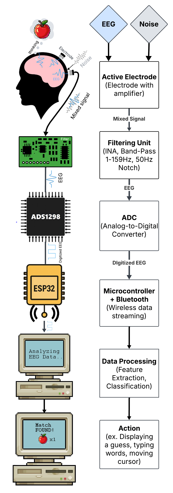

# Portable-EEG-with-Modular-Pre-Filtering-for-BCI-Applications
A Low-cost EEG BCI implementation with modular filtering card and ADS1298. The repo contains the PCB files and a guide to design your own

